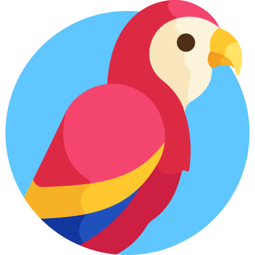

<div id="top"></div>
<!--
*** Thanks for checking out the Best-README-Template. If you have a suggestion
*** that would make this better, please fork the repo and create a pull request
*** or simply open an issue with the tag "enhancement".
*** Don't forget to give the project a star!
*** Thanks again! Now go create something AMAZING! :D
-->

<!-- PROJECT SHIELDS -->
<!--
*** I'm using markdown "reference style" links for readability.
*** Reference links are enclosed in brackets [ ] instead of parentheses ( ).
*** See the bottom of this document for the declaration of the reference variables
*** for contributors-url, forks-url, etc. This is an optional, concise syntax you may use.
*** https://www.markdownguide.org/basic-syntax/#reference-style-links
-->

[![Contributors][contributors-shield]][contributors-url]
[![Forks][forks-shield]][forks-url]
[![Stargazers][stars-shield]][stars-url]
[![Issues][issues-shield]][issues-url]
[![MIT License][license-shield]][license-url]
[![LinkedIn][linkedin-shield]][linkedin-url]

<!-- PROJECT LOGO -->
<br />
<div align="center">
  <a href="https://github.com/olidroide/lorita-bot">  
    	
  </a>
	<br />
	<i><a href="https://www.flaticon.com/free-icons/parrot" title="parrot icons">Parrot icons created by Freepik - Flaticon</a></i>

<h3 align="center">Lorita Bot</h3>

  <p align="center">
    Lorita helps you to transcript audio messages of your chat app.
    <br />
    <a href="https://github.com/olidroide/lorita-bot"><strong>Explore the docs »</strong></a>
    <br />
    <br />
    <a href="https://github.com/olidroide/lorita-bot">View Demo</a>
    ·
    <a href="https://github.com/olidroide/lorita-bot/issues">Report Bug</a>
    ·
    <a href="https://github.com/olidroide/lorita-bot/issues">Request Feature</a>
  </p>
</div>

<!-- TABLE OF CONTENTS -->

## 📝 Table of Contents

<details>
  <ol>
    <li>
      <a href="#about-the-project">About The Project</a>
      <ul>
        <li><a href="#built-with">Built With</a></li>
      </ul>
    </li>
    <li>
      <a href="#getting-started">Getting Started</a>
      <ul>
        <li><a href="#prerequisites">Prerequisites</a></li>
        <li><a href="#installation">Installation</a></li>
      </ul>
    </li>
    <li><a href="#usage">Usage</a></li>
    <li><a href="#roadmap">Roadmap</a></li>
    <li><a href="#contributing">Contributing</a></li>
    <li><a href="#license">License</a></li>
    <li><a href="#contact">Contact</a></li>
    <li><a href="#acknowledgments">Acknowledgments</a></li>
  </ol>
</details>

<!-- ABOUT THE PROJECT -->

## 💡 About The Project

[![Product Name Screen Shot][product-screenshot]](https://example.com)

How many times you're in a meeting and receives and Audio Message? you can't take your phone and listen it, needs to finish the meeting and then listen.

Lorita-Bot transcribe that Audio Message to text, and you cand read it without listen it.

<p align="right">(<a href="#top">back to top</a>)</p>

## ⛏️ Built With

- [FastAPI](https://fastapi.tiangolo.com/)
- [Python](https://www.python.org/)
- [Docker](https://www.docker.com/)
- [PyCharm](https://www.jetbrains.com/pycharm/)
- [Next.js](https://nextjs.org/)

<p align="right">(<a href="#top">back to top</a>)</p>

<!-- GETTING STARTED -->

## 🏁 Getting Started

This is an example of how you may give instructions on setting up your project locally or in a Server.

### Prerequisites

Depends of how do you want deploy it:

- Local (with Python):

  - Install `Python 3.9`, `pip` and `virtualenv` on your OS.

- Docker:
  - Install `Docker` on your OS (also I recommend install `docker-compose`)

### ⚡ Installation

- Get a free API Key at [deepgram.com](https://deepgram.com)
- Get a free API Key at [twilio.com](https://twilio.com)
- Clone the repo
  ```sh
  git clone https://github.com/olidroide/lorita-bot.git
  ```
- Create environment file `.env`
  ```js
  LORITA_BOT_DEBUG=True
  LORITA_BOT_BASEURL=/
  LORITA_BOT_LOG_LEVEL=DEBUG
  LORITA_BOT_TWILIO_ACCOUNT_SID=[Twilio Account SID]
  LORITA_BOT_TWILIO_AUTH_TOKEN=[Twilio Auth Token]
  LORITA_BOT_DG_KEY=[Deepgram API KEY]
  LORITA_BOT_BACKEND_TELEGRAM_API_KEY=[Telegram API key obtained by BotFather]
  LORITA_BOT_BACKEND_DOMAIN_NAME=[your domain name example: lorita-bot.olidroide.es]
  ```

- Deploy backend with Python 🐍

  - Make virtualenv

    ```sh
    virtualenv venv --python=python3
    ```

  - Install dependencies

    ````sh
    pip install -r requirements.txt
    ````

  - Launch server
    `sh python src/backend/main.py`

- Deploy frontend with Node 📦

  - Go to source folder of frontend

    ```sh
    cd frontend
    ```

  - Launch 

    `npm run dev`

- Deploy with Docker 🐳
  - Build docker image with docker-compose. Create this file `docker-compose.yml`
  ```yml
    version: '2.3'

    services:
      traefik:
        image: traefik:2.6.1
        container_name: traefik
        restart: always
        ports:
          - 80:80
          - 443:443
        networks:
          - world
          - internal-lan
        extra_hosts:
          - host.docker.internal:host-gateway
        dns:
          - 1.1.1.1
          - 8.8.8.8
        security_opt:
          - no-new-privileges:true
        volumes:
          - /etc/localtime:/etc/localtime:ro
          - /var/run/docker.sock:/var/run/docker.sock:ro

      lorita-bot:
        image: ghcr.io/olidroide/lorita-bot:backend-latest
        container_name: lorita-bot
        restart: unless-stopped
        depends_on:
          - traefik
        networks:
          - internal-lan
          - world
        ports:
          - 8000:8000
        environment:
          - LORITA_BOT_BACKEND_PORT=8000
          - LORITA_BOT_BACKEND_DEBUG=True
          - LORITA_BOT_BACKEND_BASEURL=/api/v1
          - LORITA_BOT_BACKEND_LOG_LEVEL=DEBUG
          - LORITA_BOT_BACKEND_DOMAIN_NAME=lorita-bot.olidroide.es
          - LORITA_BOT_BACKEND_DG_KEY=********
          - LORITA_BOT_BACKEND_TELEGRAM_API_KEY=******:******
        labels:
          - traefik.enable=true
          - traefik.docker.network=internal-lan
          # HTTP
          - traefik.http.routers.lorita-bot.rule=Host(`lorita-bot.olidroide.es`) && PathPrefix(`/api/v1`)
          - traefik.http.services.lorita-bot.loadbalancer.server.port=8000
          - traefik.http.routers.lorita-bot.entrypoints=web
          # REDIRECT
          - traefik.http.routers.lorita-bot.middlewares=lorita-bot-https-redirect
          - traefik.http.middlewares.lorita-bot-https-redirect.redirectscheme.scheme=https
          # HTTPS
          - traefik.http.routers.lorita-bot-secure.rule=Host(`lorita-bot.olidroide.es`) && PathPrefix(`/api/v1`)
          - traefik.http.routers.lorita-bot-secure.entrypoints=websecure
          - traefik.http.routers.lorita-bot-secure.tls.certresolver=letsencrypt

      lorita-bot-frontend:
        image: ghcr.io/olidroide/lorita-bot:frontend-latest
        container_name: lorita-bot-frontend
        restart: unless-stopped
        depends_on:
          - traefik
        networks:
          - internal-lan
        ports:
          - 3000:3000
        environment:
          - LORITA_BOT_BACKEND_PORT=8000
        labels:
          - traefik.enable=true
          - traefik.docker.network=internal-lan
          # HTTP
          - traefik.http.routers.lorita-bot-frontend.rule=Host(`lorita-bot.olidroide.es`)
          - traefik.http.services.lorita-bot-frontend.loadbalancer.server.port=3000
          - traefik.http.routers.lorita-bot-frontend.entrypoints=web
          # REDIRECT
          - traefik.http.routers.lorita-bot-frontend.middlewares=lorita-bot-https-redirect
          # HTTPS
          - traefik.http.routers.lorita-bot-frontend-secure.rule=Host(`lorita-bot.olidroide.es`)
          - traefik.http.routers.lorita-bot-frontend-secure.entrypoints=websecure
          - traefik.http.routers.lorita-bot-frontend-secure.tls.certresolver=letsencrypt

    networks:
      world:
        name: world
        external: true
      internal-lan:
        name: internal-lan
        external: false
        internal: true
  ```

    ```sh
    docker-compose up -d
    ```

  - Or use pre build image from
    ```sh
    docker pull ghcr.io/olidroide/lorita-bot:backend-latest
    docker pull ghcr.io/olidroide/lorita-bot:frontend-latest
    ```

<p align="right">(<a href="#top">back to top</a>)</p>

<!-- USAGE EXAMPLES -->

## Usage

Use this space to show useful examples of how a project can be used. Additional screenshots, code examples and demos work well in this space. You may also link to more resources.

_For more examples, please refer to the [Documentation](https://example.com)_

<p align="right">(<a href="#top">back to top</a>)</p>

<!-- ROADMAP -->

## Roadmap

- [x] Dockerized image
- [ ] Multilanguage detection
- [ ] More Chat app integrations
  - [ ] Telegram

See the [open issues](https://github.com/olidroide/lorita-bot/issues) for a full list of proposed features (and known issues).

<p align="right">(<a href="#top">back to top</a>)</p>

<!-- CONTRIBUTING -->

## 🤝 Contributing

Contributions are what make the open source community such an amazing place to learn, inspire, and create. Any contributions you make are **greatly appreciated**.

If you have a suggestion that would make this better, please fork the repo and create a pull request. You can also simply open an issue with the tag "enhancement".
Don't forget to give the project a star! Thanks again!

1. Fork the Project
2. Create your Feature Branch (`git checkout -b feature/AmazingFeature`)
3. Commit your Changes (`git commit -m 'Add some AmazingFeature'`)
4. Push to the Branch (`git push origin feature/AmazingFeature`)
5. Open a Pull Request

<p align="right">(<a href="#top">back to top</a>)</p>

<!-- LICENSE -->

## ✍️ License

Distributed under the GNU General Public License v2.0. See `LICENSE` for more information.

Lorita-bot logo parrot designs were created by Freepik - Flaticon [Freepik - Flaticon](https://www.flaticon.com/free-icons/parrot)

<p align="right">(<a href="#top">back to top</a>)</p>

<!-- CONTACT -->

## 📫 Contact

olidroide - [@olidroide](https://twitter.com/olidroide) - lorita@olidroide.es

Project Link: [https://github.com/olidroide/lorita-bot](https://github.com/olidroide/lorita-bot)

<p align="right">(<a href="#top">back to top</a>)</p>

<!-- ACKNOWLEDGMENTS -->

## Acknowledgments

- []()
- []()
- []()

<p align="right">(<a href="#top">back to top</a>)</p>

<!--
## 🍰 **Supporters and donators**

<a href="https://github.com/olidroide/lorita-bot/generate">
  
</a>

We are currently looking for new donators to help and maintain this project! ❤️

By donating, you will help the development of this project, and *you will be featured in this project's README.md*, so everyone can see your kindness and visit your content ⭐.

<a href="https://github.com/sponsors/olidroide">
  
</a>
-->

<!--
## 🎉 Help us raise these numbers up

[](https://github.com/olidroide)
[](https://github.com/olidroide/lorita-bot/stargazers)
[](https://github.com/olidroide/lorita-bot/watchers)
[](https://github.com/olidroide/lorita-bot/network/members)
-->

<!-- MARKDOWN LINKS & IMAGES -->
<!-- https://www.markdownguide.org/basic-syntax/#reference-style-links -->

[contributors-shield]: https://img.shields.io/github/contributors/olidroide/lorita-bot.svg?style=for-the-badge
[contributors-url]: https://github.com/olidroide/lorita-bot/graphs/contributors
[forks-shield]: https://img.shields.io/github/forks/olidroide/lorita-bot.svg?style=for-the-badge
[forks-url]: https://github.com/olidroide/lorita-bot/network/members
[stars-shield]: https://img.shields.io/github/stars/olidroide/lorita-bot.svg?style=for-the-badge
[stars-url]: https://github.com/olidroide/lorita-bot/stargazers
[issues-shield]: https://img.shields.io/github/issues/olidroide/lorita-bot.svg?style=for-the-badge
[issues-url]: https://github.com/olidroide/lorita-bot/issues
[license-shield]: https://img.shields.io/github/license/olidroide/lorita-bot.svg?style=for-the-badge
[license-url]: https://github.com/olidroide/lorita-bot/blob/master/LICENSE.txt
[linkedin-shield]: https://img.shields.io/badge/-LinkedIn-black.svg?style=for-the-badge&logo=linkedin&colorB=555
[linkedin-url]: https://linkedin.com/in/olidroide
[product-screenshot]: images/screenshot.png
